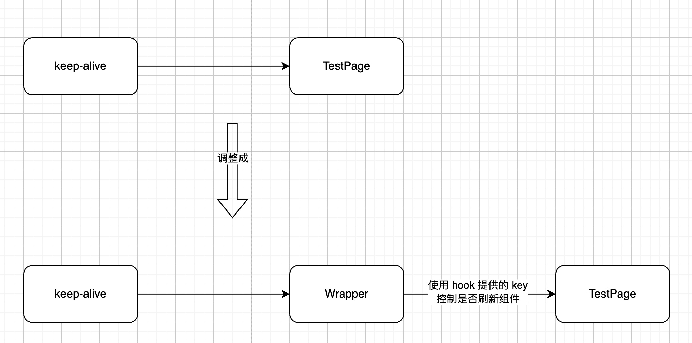

# 使用 Vue keep-alive 组件遇到的问题总结

> 这里主要总结一下使用 keep-alive 组件实现 Tabs 页效果时遇到的问题。大部分的问题在很多文章都有解决方法，所有这里主要详细地说下我觉得比较麻烦的问题，而其他问题这里就简单地展示下核心代码
>
> 以下代码使用的是 Vue3


## 如何缓存同一个组件不同的页面？

比如有多个页面，它们的 URL 不一样，但用的是同一个组件，这要如何缓存？

通过在 `component` 组件添加 `:key="route.fullPath"` 来解决

```vue
<router-view v-slot="{ Component }">
  <keep-alive>
    <component :is="Component" :key="route.fullPath" />
  </keep-alive>
</router-view>
```


## 如何动态控制是否缓存页面？

有些页面需要缓存，有些不用，这里可以使用 `keep-alive` 组件的 `include` 属性来处理

> 下面代码的 `cacheRouter` 就是一个字符串数组，存储需要缓存的组件 `name`  属性，至于存储方式看你的选择，我这里用的是 Pinia，具体实现就不展示了

```vue
<router-view v-slot="{ Component }">
  // 使用 include，动态控制需要缓存的组件
  <keep-alive :include="cacheRouter">
    <component :is="Component" :key="route.fullPath" />
  </keep-alive>
</router-view>
```


## 缓存同一个组件不同的页面，如何移除某个页面时不影响其他同组件的页面？

首先，`keep-alive` 组件是根据组件的 `name` 属性判断是否要缓存

而现在有一种情况，有两个页面 /p1-a 和 /p1-b，都使用下面的组件：

```vue
<template>
  <input v-model="val" />
</template>
<script>
export default {
  name: 'Test'
}
</script>
<script setup>
import { ref } from 'vue'
const val = ref('')
</script>
```

然后分别进入页面 /p1-a -> /p1-b -> /p2-1

接着移除 /p1-b 页，再重新打开 /p1-b，我期望的是 /p1-b 页面是被重置的，而不是缓存 

我们使用上面的配置，展示下：


p1-a 和 p1-b 是同一个组件但不同路由，两个组件的不断切换，缓存是正常的；当移除了 p1-b，再重新打开 p1-b 的时候，我想要的效果该页面是重置的，但显示出来的效果还是被缓存了。

具体原因我们可以通过左侧的 vue-devtools 看到，就算 p1-b 移除了，它还是被 `keep-alive` 组件缓存着，我们不能修改 `include` 把 p1-b 的组件 `name` 去掉，因为 p1-a 还在 Tab 中显示，还需要缓存着


### 解决方法

这个问题比较麻烦，我搜了下网上的文章和一些开源的管理后台模板，没找到解决的方法。虽然我这里的处理方法有点麻烦，但好歹是解决了！

对于这种情况，我的解决方法是：

1. 添加一个 hook，使用 `key` 来控制页面组件是否刷新
2. 添加一个包裹组件，引入原来的组件，使用 hook 提供的 key 添加到组件上
3. 使用 EventBus 来通知对应的组件，是否要刷新插槽

首先添加一个 hook：

```typescript
import { onActivated, onUnmounted, ref } from 'vue'
import eventBus from './eventbus'

export default (comKey: string) => {

  const key = ref(`${Date.now()}`)
  const isRefresh = ref(false)
  const cb =  ((tmpKey: string) => {
    // 如果当前组件不存在缓存时，刷新 key
    if (tmpKey === comKey) {
      isRefresh.value = true
    }
  })
  // eventBus 自己实现或者找现成的
  eventBus.on('remove', cb)

  onActivated(() => {
    if (isRefresh.value) {
      isRefresh.value = false
      key.value = `${Date.now()}`
    }
  })
  onUnmounted(() => {
    eventBus.off('remove', cb)
  })

  return {
    key,
    isRefresh
  }
}

```

包裹组件：

```vue
<template>
  <Test :key="key" />
</template>

<script lang="ts">
export default {
  name: 'TestOnePage'
}
</script>

<script lang="ts" setup>
import { useRoute } from 'vue-router';
import PTwo from './PTwo.vue'
import useControlComponent from '../../useControlComponent';

const route = useRoute()
// 这里要添加一个唯一值，我这里 demo 使用的是路由地址
const comKey = route.fullPath
const { key } = useControlComponent(comKey)
</script>
```

之所以要引入一个包裹组件，是因为我要原组件的所有内容，如果不这样处理，整个组件的数据是不会被重置的。这样当我要移除 /b 页的缓存时，使用 EventBus 发送“删除”事件，hook 就会根据 `comKey` 来判断是否要刷新 key



整个变化如上图，添加多一个包裹组件和 hook，用于更新组件

Demo 执行效果：


p1-a 和 p1-b 是同一个组件但不同路由，p2-a 和 p2-b 也是一样。每次切换 tab 时，路由是有变化的，同组件的页面的缓存也是正常的，并且可以在左侧的 vue-devtools 中看到组件状态，虽然一直被 `keep-alive` 缓存着，但重新打开“移除”的页面，页面是被重置了

这样就解决了我们上面说到的问题，同组件不同页面会存在缓存问题

有兴趣的可以 git clone 这个 [demo](https://github.com/rni-l/vue-keep-alive-demo) 来看下具体的效果，我把 demo 代码上传到 github 了。并且用了 vitest 给这个 `hook`  来写了下单元测试~~

## 总结

1. 使用 `keep-alive` 组件实现 Tab 页缓存效果
2. 给渲染的 Component 组件添加 `:key="route.fullPath"`，实现可以缓存同一组件但不同路由的页面
3. 给 `keep-alive` 组件添加 `:include` 属性，控制缓存哪个页面
4. 使用一个包裹组件和 `:key` 属性，用于控制刷新目标组件，解决缓存同一组件但不同路由的页面下的缓存异常问题

