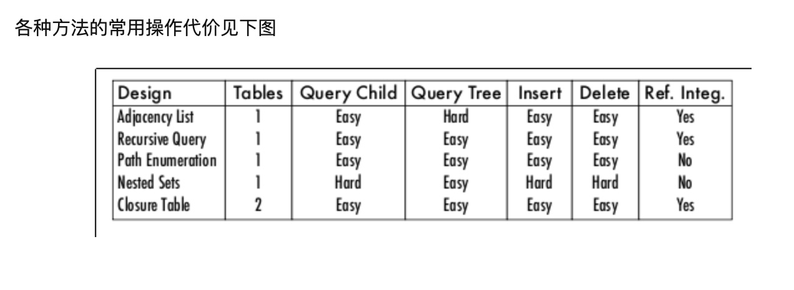

---

https://www.swiper.com.cn/title: mysql
date: 2018-09-11 10:26:00
tags: ["mysql"]
categories: ["记录"]
draft: true
---

# Mysql

## 基础

连接 mysql

```
mysql -u root -p
```

常规查询

```mysql
SHOW DATABASES;
SHOW TABLES;
SHOW COLUMNS FROM table_name;
SHOW variables; // 查询 mysql 变量设置
SHOW variables LIKE '%datadir%'; // 查询数据存放位置
```

### 表

#### 创建表

```
 CREATE TABLE orders (
  order_num int NOT NULL AUTO_INCREMENT,
  order_name VARCHAR(32) NOT NULL,
  order_date datetime NULL,
  PRIMARY KEY(order_num)
 ) ENGINE = InnoDB;
 
 CREATE TABLE design (
  order_num int NOT NULL AUTO_INCREMENT, PRIMARY KEY(order_num)) ENGINE = InnoDB;
```

具体的结构：column_name data_type attrbitues....

* NOT NULL：不允许空值
* AUTO_INCREMENT：自增值
* PRIMARY KEY()：设置该表的主键；主键可以多个值，用逗号分隔
* ENGINE：使用什么引擎

#### 更新表

```
ALTER TABLE orders ADD test varchar(32) NULL;
ALTER TABLE orders DROP COLUMN test;
```

#### 删除表

```
DROP TABLE orders;
```

#### 重命名

```
RENAME TABLE orders2 to orders;
```

### 插入数据

```
// 按照表的默认顺序添加数据
INSERT INTO orders VALUES (null,   'test',   '2018-02-11' );

// 按照给定的列，插入数据
INSERT INTO orders(
  order_name, order_date)
  VALUES(
  'test2', '2018-02-12');

// 插入多行数据
INSERT INTO orders(
    ->   order_name, order_date)
    ->   VALUES(
    ->   'test2', '2018-02-12'),
    ->   ('test3', '2018-03-11');
```

### 更新数据

```
// 会更新在 orders 表中，所有的 order_name 值为 'test_update'
UPDATE orders SET order_name = 'test_update';

// 会更新在 orders 表中，当 order_name === 'test' 的那一行的数据，设 order_name 值为 'test_update'
UPDATE orders SET order_name = 'test_update' WHERE order_name = 'test';
```

注意：

如果更新数据时，发生错误（比如数据格式不正确），会终止更新，并回滚到更新前的数据。但是可以添加 IGNORE 关键字，继续更新下去。

`UPDATE IGNORE orders SET…….`

### 删除数据

```
DELETE FROM orders WHERE order_name = 'test';
```

### 查询数据

```
// 查询 orders 表中所有的数据
SELECT * FROM orders;
```

#### 排序

使用 `ORDER BY` 进行对数据排序，默认为升序（ASC），降序为（DESC）。

```
// 升序排序，a-z
SELECT * FROM orders ORDER BY;

// 降序排序，z-a
SELECT * FROM orders ORDER BY DESC;
```

排序可以多个值进行排序

```
// 先对 order_name 进行降序排序，再对后续的数据根据 order_date 进行升序排序
SELECT * FROM orders ORDER BY order_name DESC, order_date;
```

如果语句中有 WHERE 关键词，ORDER BY 要放在 WHERE 后面。

#### 过滤

```
// 只获取 order_name = 'test' 那些行的数据
SELECT * FROM orders WHERE order_name = 'test';

// 只获取 order_name !== 'test' 那些行的数据
SELECT * FROM orders WHERE order_name != 'test';

// 大小于
SELECT * FROM orders WHERE price >= 1 AND number <= 100;
```

`!=` 和 `<>` 效果一致。

```
// 使用 between and，获取指定区间内的数据
SELECT * FROM orders WHERE price BETWEEN 5 AND 10;

// 判断是否空值
SELECT * FROM orders WHERE price IS NULL;
```

```
// AND 操作符，相当于 &&
SELECT * FROM orders WHERE price >= 1 AND number <= 100;

// OR，相当于 ||
SELECT * FROM orders WHERE price >= 1 OR number <= 100;
```

AND 的优先级比 OR 更高，必要时可以添加括号

```
SELECT * FROM orders WEHRE (id = 1 OR id = 2) AND price >= 1;
```

使用 IN 可以过滤得到指定的几个值

```
SELECT * FROM orders WHERE price IN (10, 20, 50);
```

IN 的效果，其实可以用 OR 去代替，但是 IN 具有其他优势：

1. 更清楚直观过滤的值
2. 更容易管理（操作符更少）
3. 比 OR 执行得更快（不确定）
4. IN 可以包含其他 SELECT 语句，使得可以更动态建立 WHERE 语句

```
// NOT 否定功能
SELECT * FROM orders WHERE price NOT IN (10, 20, 50);
```

NOT 可以对 IN, BETWEEN, EXISTS 子句取反。

#### 通配符

```
// 查询以 ddd 开头的
SELECT * FROM orders WHERE order_name LIKE 'ddd%';

// 查询包含 ddd 的
SELECT * FROM orders WHERE order_name LIKE '%ddd%';

// 查询以 ddd 开头的，后跟一位任意字符的
SELECT * FROM orders WHERE order_name LIKE 'ddd_';
```

`_` 匹配任意一字符，`%` 匹配任意字符

### 创建字段

```
// 使用 concat 函数，封装一个新的字段(将变量和字符串连接)
SELECT CONCAT(order_name, '(', order_date, ')') FROM orders;

// 使用 as (别名) 可以给新字段创建一个名称
SELECT CONCAT(order_name, '(', order_date, ')') AS title FROM orders;

// 在查询中做数学运算
SELECT quantity*price AS all_price FROM orders;
```

### 分组

```
// 给 order_name 进行分组，并统计每组 order_name 的数据
SELECT order_name, COUNT(*) FROM orders GROUP BY order_name;
```

GROUP BY 子句必须在 WHERE 后， ORDER BY 前

```
// 可以使用 HAVING 给分组进行过滤
// 只显示大于 2 的分组
SELECT order_name, COUNT(*) FROM orders GROUP BY order_name HAVING COUNT(*) > 2;
```

`HAVING` 和 `WHERE` 语法一直，功能类似。`WHERE` 给每行数据进行过滤，`HAVING` 给每个分组进行过滤


### 事务

对于需要连续执行的 sql 且保证每条语句都执行顺利的情况下，可以使用事务。当某条查询失败可以进行回滚操作，回到初始状态。

```
// mysql
START TRANSACTION
INSERT INTO users ....;
SELECT * FROM users;
INSERT INTO users ....; // error
ROLLBACK;
// if success
SELECT * FROM users;
COMMIT;
```

使用了 ROLLBACK 或者 COMMIT 就会结束事务。

如果像回滚到某个节点，可以使用 SAVEPOINT

```
// mysql
START TRANSACTION
INSERT INTO users ....;
SAVEPOINT user1;
SELECT * FROM users;
INSERT INTO users ....;
SAVEPOINT user2;
ROLLBACK user1;
```

```javascript
// nodejs 中的 mysql 使用
// 把 beginTransaction, query, rollback, commit 进行封装成 promise
const dbTransactions = () => {
  return new Promise((resolve) => {
    getPool().getConnection((err, connection) => {
      if (err) {
        return resolve(handleData({ err }))
      }
      resolve({
        beginTransaction: () => {
          return new Promise(resolve => {
            connection.beginTransaction(err => {
              if (err) {
                return resolve({ isSuccess: false, data: err })
              }
              return resolve({ isSuccess: true, data: '' })
            })
          })
        },
        query: (sql) => {
          return new Promise(resolve => {
            connection.query(sql, (err, data) => {
              if (err) {
                return resolve({ isSuccess: false, data: err })
              }
              return resolve({ ...handleData({ data }), isSuccess: true })
            })
          })
        },
        rollback: () => {
          return new Promise(resolve => {
            connection.rollback(err => {
              resolve(err)
            })
          })
        },
        commit: () => {
          return new Promise(resolve => {
            connection.commit(err => {
              if (err) {
                return resolve({ isSuccess: false, data: err })
              }
              return resolve({ isSuccess: true, data: '' })
            })
          })
        },
        connection,
        isSuccess: true
      })
    })
  })
}

// eggjs, service use
async test() {
  const transactions = await this.ctx.helper.dbTransactions()
    // 连接失败
    if (!transactions.isSuccess) return this.formatData(transactions)
    const { query, rollback, commit, connection, beginTransaction } = transactions
    const beginTransactionResult = await beginTransaction()
    // 开启事务失败
    if (!beginTransactionResult.isSuccess) return this.formatData(beginTransactionResult)
    const sql1 = `INSERT INTO wechat(nickname, mobile, openid) VALUES(
      'thah', '123', 'sdfsdfsf'
    );`
    const sql2 = `INSERT INTO wechat(nickname, mobile, openid) VALUES(
      hah, '123', 'sdfsdfsf'
    );`
    const sql3 = `SELECT * FROM wechat;`
    const queryOneResult = await query(sql1)
    // 查询失败，回滚
    if (!queryOneResult.isSuccess) {
      await rollback()
      return this.formatData(queryOneResult)
    }
    const queryTwoResult = await query(sql2)
    if (!queryTwoResult.isSuccess) {
      await rollback()
      return this.formatData(queryTwoResult)
    }
    const queryThreeResult = await query(sql3)
    if (!queryThreeResult.isSuccess) {
      await rollback()
      return this.formatData(queryThreeResult)
    }
    const commitResult = await commit()
    if (!commitResult.isSuccess) return this.formatData(commitResult)
    connection.release()
    return this.handlePageData(queryThreeResult)
}

```

在 nodejs 中 mysql 这个库找不到有 `SAVEPOINT` 。。。。有点尴尬


### 常用函数

* concat: 连接字符串，新建一个新字段
* Trim,LTrim,RTrim: 去除空格
* Length: 返回串的长度
* Lower, Upper: 转换大小写
* 聚集函数
  * AVG: 返回某列的平均值
  * COUNT: 行数
  * MAX: 最大值
  * MIN: 最小值
  * SUM: 总和


### 子查询

select 语句中的子查询，是从内向外

```mysql
select * from orders where orderNum in (select orderNum from orderitems);
```

先查询内查询，返回对应的数据给 `orderNum in` 去做判断


### 组合查询

> 使用 UNION 操作符，可以组合多条 sql 查询

```mysql
SELECT a FROM orders WHERE a <= 5
UNION
SELECT A from orders WHERE a in (12,13);
```

`UNION` 将两条 sql 语句合并在一起

使用条件：

1. 要有多条 sql 语句
2. 每个查询有相同的列
3. 列数据类型要兼容


### 视图

> 就是 SQL 语句的封装

限制：

1. 唯一命名
2. 视图不能索引、关联触发器或默认值

#### 增删查

```mysql
# 创建 p1 的视图
CREATE VIEW p1 AS select * from t2 LIMIT 5;
# 使用
SELECT * FROM p1;
# 查询视图内容
SHOW CREATE VIEW p1;
# 删除
DROP VIEW p1;
```


### 存储过程

> 报错多条 SQL 语句的集合


### 游标


### 触发器


### 类型


## 备份数据库

```shell
// max os
// 把整个数据库(包括数据导出)
mysqldump -u root -p  database_name > /Users/apple/D/document/test.sql // 然后输入该账户登录的密码就行了
mysqldump -u root -p  database_name user wechat > /Users/apple/D/document/test.sql // 备份 user 和 wechat 两个表的结构和数据
mysqldump -u root -p -l -F database_name > /Users/apple/D/document/test.sql // -l 添加锁 -F 生成一个新的日志文件

// 备份选项
-A,--all-databases：该选项表示备份实例中的所有数据库
-B,--databases：指定要备份的数据库名称，后面可以同时跟多个数据库
-E,--events：表示备份过程中包括数据库中的事件
-F,--flush-logs：表示备份完成之后刷新日志，滚动日志点，如果没有开启二进制日志，使用该选项会提示错误
--flush-privileges：表示备份最新的权限表数据
--hex-blob：表示备份过程中包括数据库中的二进制数据(BINARY,VARBINARY,BLOG)
-x,--lock-all-tables：该选项的作用是在备份过程中锁定所有的表，通常用于备份MyISAM存储引擎类型的表数据
--single-transaction：该选项表示备份过程中保证数据的一致性，使用事务隔离状态和一致性快照保证，目前只支持InnoDB类型的表
    注：--lock-all-tables选项和--single-transaction选项同时只能用一个
--master-data=N：该选项用来设置在导出的数据中是否包括对二进制日志文件和日志点的记录，常用的值有：1和2
    1：表示在导出的sql文件中包括了"change master to master_log_file='',master_log_pos=N"内容，用来做快速主从复制
    2：表示在导出的sql文件中不包括"change master to master_log_file='',master_log_pos=N"内容
-t,--no-create-info：表示只备份数据，不备份表的创建信息
-d,--no-data：表示只备份表结构，不备份任何数据
-R,--routines：表示备份中同时备份存储过程和函数
--tables：如果不需要备份整个库，只需要备份部分表，可以使用该选项指定
--triggers：表示备份中同时备份触发器
-u：指定完成备份操作的用户名
-p：指定完成备份操作的用户密码
-h：指定完成备份操作的域名或者ip地址
-P：指定完成备份操作的端口号。注意，是大写的P
```

```
// 恢复数据
mysql -u root -p {dbname} < /Users/apple/D/document/test2.sql
```


## 执行 sql 文件

1）进入mysql
2）create database 我们的数据库名
3）use database 我们的数据库名
4）source 地址 （不包含引号，因为拖拽文件到的，不包含引号）


## 常见问题解决

### emoji 表情问题

将 character 改为 utf8mb4 即可。因为 emoji 的存储是4个字节，而 utf8 最多是3个字节，所以导致无法存储。

[解决教程](https://mathiasbynens.be/notes/mysql-utf8mb4#utf8-to-utf8mb4)


### 树形结构存储方式

一般比较普遍的就是四种方法：（具体见 SQL Anti-patterns这本书）

1. Adjacency List：每一条记录存parent_id
2. Path Enumerations：每一条记录存整个tree path经过的node枚举
3. Nested Sets：每一条记录存 nleft 和 nright
4. Closure Table：维护一个表，所有的tree path作为记录进行保存。



参考资料：https://www.zhihu.com/question/20417447

## 优化总结

### 使用如果是查询某条数据，使用 limit 1。这样到数据库找到某条数据后就回停止查询，不再继续查。

```mysql
mysql> select * from t2 where h ="name50000";
+-----------+------+
| h         | c    |
+-----------+------+
| name50000 | NULL |
+-----------+------+
1 row in set (0.04 sec)

mysql> select * from t2 where h ="name50000" limit 1;
+-----------+------+
| h         | c    |
+-----------+------+
| name50000 | NULL |
+-----------+------+
1 row in set (0.02 sec)

10 万行数据，中间的数据加了 limit 1，快了一倍的速度
```


### char 用于定长，varchar 用于可变长，这样效率会更好


## mysql 安装

echo "================================================================="

echo "开始安装mysql"
echo "================================================================="

echo "================================= 添加MySql的yum reposity ================================"
wget http://dev.mysql.com/get/mysql57-community-release-el7-7.noarch.rpm
yum localinstall mysql57-community-release-el7-7.noarch.rpm

echo "================================= 查看yum reposity是否安装成功 ================================"
yum repolist enabled | grep "mysql.*-community.*"

echo "================================= 安装mysql ================================"
yum install mysql-community-server

echo "================================= 安装的mysql版本 ================================"
mysql --version


#### mysql 初始化

```shell
chown mysql:mysql -R /var/lib/mysql
mysqld --initialize
systemctl start mysqld 
```


1. 如果启动时报错
2. \#(删除/var/lib/mysql下的所有文件)mysql 数据文件路径
3. \#(删除锁定文件)

```shell
rm -fr /var/lib/mysql/* 
rm /var/lock/subsys/mysqld
```


#### 启动mysql

```shell
systemctl start mysqld 
```


echo "================================= MySql的初始密码是 ================================"

cat /var/log/mysqld.log | grep password  # 获取初始密码 

alter user root@localhost identified by 'Admin@123456';
update user set host = '%' where user ='root';
FLUSH PRIVILEGES;

