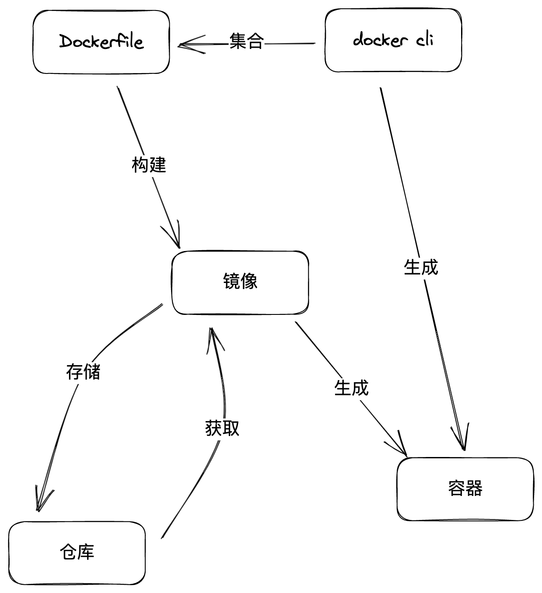

 # Docker 学习记录

## 核心

三个大概：

1. 容器
2. 镜像
3. 仓库




## Dockerfile

> 写法

### 常见例子

#### 搭建一个 Nginx 镜像，可以随意指定目录

##### Cli 命令

```shell
docker run --name {容器名称} -v {目标地址}:/usr/share/nginx/html:ro -d -p {暴露端口}:80 nginx
```

##### Dockerfile

1. 在某个目录下新建 Dockerfile:

   ```dockerfile
   FROM nginx
   COPY ./ /usr/share/nginx/html
   ```

2. 生成镜像：`docker build -t {镜像名称} ./`

3. 运行镜像：`docker run --name {容器名称} -d -p 8081:80 {镜像名称}`

##### 区别

cli 命令中用的是 `-v` 进行挂载存储区；而 dockerfile 用的是 COPY，将要运行的 html 复制到容器中。在 dockerfile 中，无法像 `cli` 那样使用 `-v` 命令，去挂载一个真实的目录


#### 搭建一个 Node 环境

> 基于这个 Node 环境，进行前端项目的依赖安装、构建和生产运行。支持环境变量

#### 用于构建和部署到 nginx

```dockerfile
FROM node:16.19
COPY ./app ./
RUN npm i && npm run build

FROM nginx:alpine
COPY --from=0 /dist /usr/share/nginx/html
EXPOSE 80
```


## 持续存储

> Docker 有两种持续存储的方式：Named Volume 和 Bind Mounts，具体的区别可以看下官方的这个表格对比：

|                                              | Named Volumes             | Bind Mounts                   |
| :------------------------------------------- | :------------------------ | ----------------------------- |
| Host Location                                | Docker chooses            | You control                   |
| Mount Example (using `-v`)                   | my-volume:/usr/local/data | /path/to/data:/usr/local/data |
| Populates new volume with container contents | Yes                       | No                            |
| Supports Volume Drivers                      | Yes                       | No                            |

[Docker - bind mounts](https://docs.docker.com/get-started/06_bind_mounts/)

### Named Volume

### Bind Mounts

```dockerfile
docker run --name {容器名称} -v {目标地址}:/usr/share/nginx/html:ro -d -p {暴露端口}:80 nginx
```

比较经典的例子，使用 docker cli 中的 `-v` 命令，将机器的真实目录，挂载到容器层的某个目录。当我们修改目录的文件，会同步生效。


## Docker-Compose


