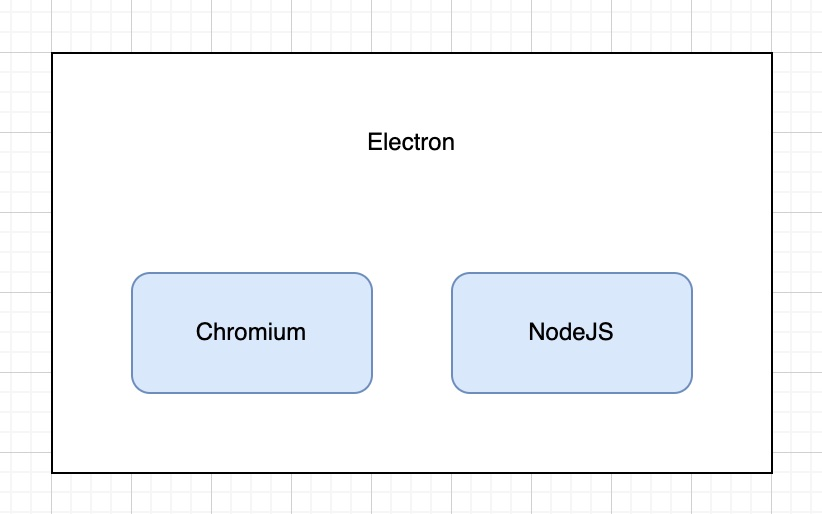
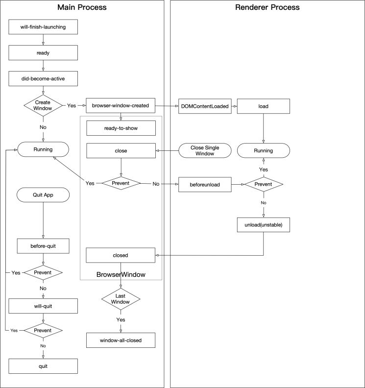

# Electron 基础概念

> 用于记录内容，方便查询。

> 记录 Electron 是什么，能干嘛，优缺点和它的进程模型

## Electron 是什么？

>Electron是一个使用 JavaScript、HTML 和 CSS 构建桌面应用程序的框架。 嵌入 [Chromium](https://www.chromium.org/) 和 [Node.js](https://nodejs.org/) 到 二进制的 Electron 允许您保持一个 JavaScript 代码代码库并创建 在Windows上运行的跨平台应用 macOS和Linux——不需要本地开发 经验。

Electron 是一个桌面应用程序的框架，嵌入了 Chrome 的核心：Chromium 和 Node.js，使你可以使用 JavaScript 开发，并在 Windows、MacOS 和 Linux 上运行。

## 主进程和渲染进程

Electron 是一个多进程架构：主进程 + n * 渲染进程。

主进程：

1. 只有一个主进程
2. 用于管理渲染进程
3. 通信中心
4. 窗口管理
5. 应用程序声明周期
6. 提供原生 API 和 NodeJS API

渲染进程：

1. 可以生成多个渲染进程
2. 用来渲染网页内容

### 生命周期一图流

## 优缺点

优点：

1. 适合 JavaScript 体系开发，上手简单
2. 同构框架，适用于多个平台
3. 框架成熟，现在已经到 v16 + 版本，有很多成功的桌面应用，比如 VsCode 和 Postman
4. 有不错的生态

缺点：

1. 体积大，因为集成了 Chromium 和 NodeJS
2. 占用内存大

## 参考资料

1. [Electron 官方中文文档](https://www.electronjs.org/zh/docs/latest/)
2. [Electron 官方文档 - App 生命周期事件](https://www.electronjs.org/zh/docs/latest/api/app)
3. [阿里巴巴淘系技术-  Electron 生命周期介绍](https://zhuanlan.zhihu.com/p/352668011)

