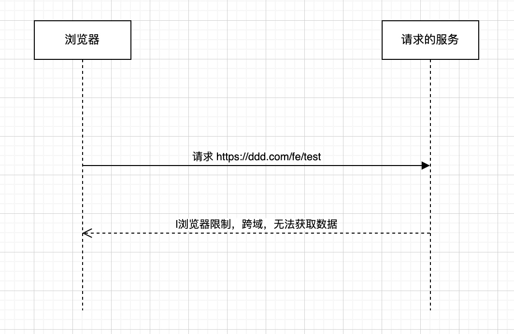
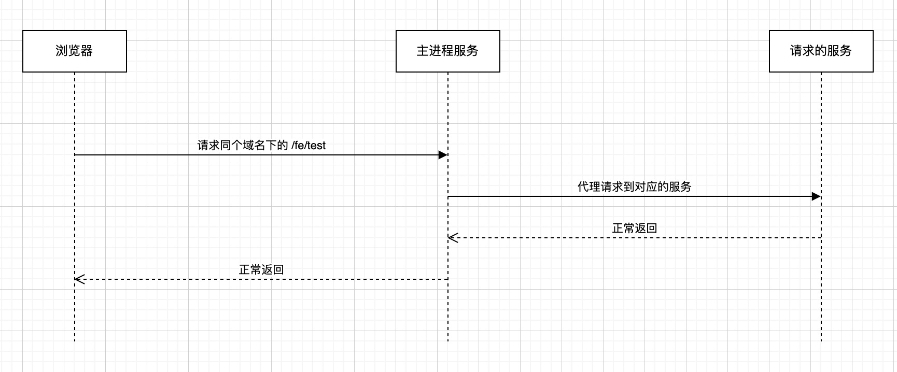

# Electron 跨域问题

> 用于记录内容，方便查询。

> 记录在开发时遇到的跨域问题

## 什么是跨域

详细可以看 [跨域配置](/note/frontend/安全问题/跨域配置.html)。

## 在 Electron 开发中为什么会遇到跨域问题？

使用 Electron 打开页面时，显示形式有两种：访问本地文件和开启本地服务，下面列出两种方式的优缺点。

### 访问本地文件

```javascript
// 伪代码
const pageUrl =  new URL('../renderer/dist/index.html', 'file://' + __dirname).toString();

browserWindow.loadURL(pageUrl);
```

直接打开本地文件，这时候浏览器的 URL 就是：`file:///xxxx/renderer/dist/index.html` 这种格式，相当于我们在 chrome 浏览器打开本地 `.html` 文件。

优点：

1. 直接打开本地文件，无需其他操作
2. 速度快

缺点：

1. 无法使用 Cookie，原因请看 [跨域配置.html#本地文件如何设置-cookie](/note/frontend/安全问题/跨域配置.html#本地文件如何设置-cookie)
2. 需要解决请求跨域的问题

### 开启本地服务

```javascript
// 伪代码
import Koa from 'koa';
import serve from 'koa-static';
const app = new Koa();
app.use(serve(join(__dirname, '../../')));
app.listen(13333,()=>{
    console.log('启动成功');
});

await browserWindow.loadURL('http://localhost:13333/renderer/dist/index.html');
```

使用 `NodeJS` 开启一个本地服务。

优点：

1. 可以使用 cookie
2. 可以解决 http 跨域请求的问题，通过配置 `NodeJS` 的代理服务

缺点：

1. 需要占用一个端口
2. 相比直接访问本地文件，需要更多的内存开销

#### 如何解决跨域

> 在不让业务端添加跨域头的情况下，解决跨域问题

##### 通过主进程代理

在渲染进程发起一个请求：

```javascript
axios('https://ddd.com/fe/test')
```

这时候浏览器会报跨域问题，但我们使用 `NodeJS` 开启服务进行访问的，可以进行代理操作。



渲染进程的请求代码改为：

```javascript
aixos('/fe/test') // 请求当前域名下的 /fe/test 接口
```

主进程：

```javascript
// 伪代码
import Koa from 'koa';
import createProxyMiddleware from 'koa-proxies';

const app = new Koa();
const middle = createProxyMiddleware('/fe/test', { target: 'https://ddd.com', changeOrigin: true });
  app.use(middle);

```

然后在主进程进行一个代理操作，简单来说，请求的流程变成这样：



通过主进程的代理操作，解决跨域问题。同样 cookie 也是可以这样处理。

##### 关闭安全模式

通过设置 `webPreferences.webSecurity: false` 关闭安全模式，可以允许网页进行跨域请求，并且服务端的 API 无需设置跨域头。

```javascript
// 伪代码
new BrowserWindow({
  webPreferences: {
    webSecurity: false,
  },
});
```

但这种设置，`electron` 官方文档不支持在生产模式使用：

> 禁用 `webSecurity` 将会禁止同源策略并且将 `allowRunningInsecureContent` 属性置 `true`。 换句话说，这将使得来自其他站点的非安全代码被执行。

## 参考资料

1. [electron 文档 - 安全](https://www.electronjs.org/zh/docs/latest/tutorial/security#%E6%B8%85%E5%8D%95%E5%AE%89%E5%85%A8%E5%BB%BA%E8%AE%AE)
