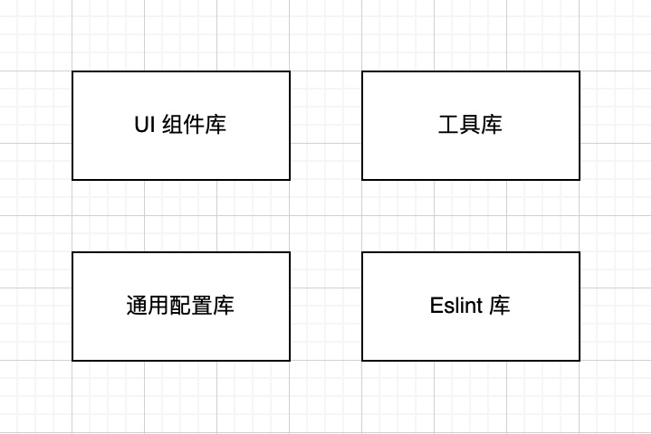
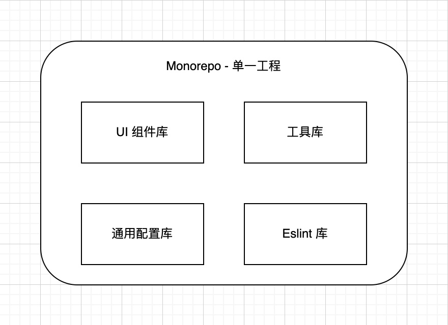

# Monorepo

> 只用于个人记录，内容参考“参考资料”中所例举的资料。

## 什么是 `Monorepo`

`monorepo` 是一种软件工程的架构方式，是一个概念，它在一个单一工程内，包含了多个包，统一控制管理每个包的版本和包与包之间的依赖关系。`monorepo` 需要框架或工具去实现，比如 `npm` 和 `yarn` 的 `workspaces` 配置，`lerna`、`turborepo`、`nx` 和 `rush` 等框架。

比如一个部门的前端组件库，有以下几个：UI 组件、工具库、通用配置库和 Eslint 配置库。常见的架构就是一个库一个工程：

这里就有了 4 个工程，而且工程之间如果有被依赖的话，开发模式就变成这样了：

1. UI 组件库依赖 Eslint 库
2. 有新的 Eslint 规则要修改，修改 Eslint 库，发布
3. UI 组件库更新 Eslint 库的版本号并安装依赖
4. UI 组件库发布版本

而 `monorepo` 架构则变成这样：

一个工程内包含了四个库，库之间如果有依赖关系，则 `monorepo` 会通过“链接”的形式进行引用，避免了频繁发布版本的问题：

1. UI 组件库依赖 Eslint 库
2. 有新的 Eslint 规则要修改，修改 Eslint 库
3. 工程发布，Eslint 库和 UI 组件库发布新版本

整个流程中，UI 组件库无需更新 Eslint 版本号和安装依赖，`monorepo` 通过“链接”的形式解决了这个麻烦的问题。

上面只是简单地描述了什么是 `monorepo`，下面我们来详细说下 `monorepo` 的优缺点。

## 优缺点

### 优点

#### 方便依赖管理

将各个相关库的代码集合到一个工程内，解决库之间依赖相互调用的问题，这个是大大提升了开发时的效率。并且可以优化整个工程的 node_modules 的依赖大小，比如将所有的库的依赖通通在工程根目录进行安装，或者是像 `turborepo` 第三方依赖也进行链接的形式，进行缓存处理。

#### 便于代码重用

因为 `monorepo` 的架构，使依赖之间的引用非常简单，可以将库之间的代码进行抽离复用。

#### 确保 commit 原子化

以前多工程架构下相互依赖的问题，当一个库要发布新版本时，其他引用了该库的工程也要随之升级版本。而在 `monorepo` 架构下，所有工程的版本都是由框架统一管理，可以一并发布所有需要更新版本的工程。

#### 便于多人开发

虽然是同一个工程，但库之间的代码还是以包的形式拆分开来，这样不同的团队开发不同的库，代码之间冲突也会随之大大减少。

### 缺点

#### 项目会相对复杂

使用了 `monorepo` 的项目，也就需要引入框架去进行管理各个 `package`，需要学会怎么去使用框架。

#### 需要更多本地存储空间

有些开发者只需要开发里面的部分库，但 `monorepo` 的架构原因，他需要下载其他不需要的库的代码，并安装其依赖。虽然 `monorepo` 已经优化了 `node_modules`  的大小，但相对只需要一个库的依赖，还是大很多。

#### 项目权限访问问题

如果是较大的项目并且需要对每个库进行权限控制，那在 `monorepo` 的架构就做不了。只要得到了这个工程的权限，就能获取所有的代码了，并且提交代码的时候，也有可能改到别的库的代码。

## 什么项目应该用？

1. 项目较大，且有不同的端
2. 有多个库，库之间存在相互依赖的关系，并且需要单独暴露每个库，有版本管理
3. 不需要对某个库进行权限控制

## 实践

实践的方式，采取下面的规则：

1. 多包项目
2. 需要生成 changelog 
3. 需要有 Husky 等 git 钩子的配置，并进行 eslint 检查
4. 尽可能优化 node_modules
5. 提供文档，说明项目的安装、运行、发布

1. [lerna 实践](/ddd.html)
2. [turborepo 实践](/ddd.html)

## 参考资料

1. [wiki - monorepo](https://en.wikipedia.org/wiki/Monorepo#:~:text=In%20version%20control%20systems%2C%20a,as%20a%20'shared%20codebase'.)
