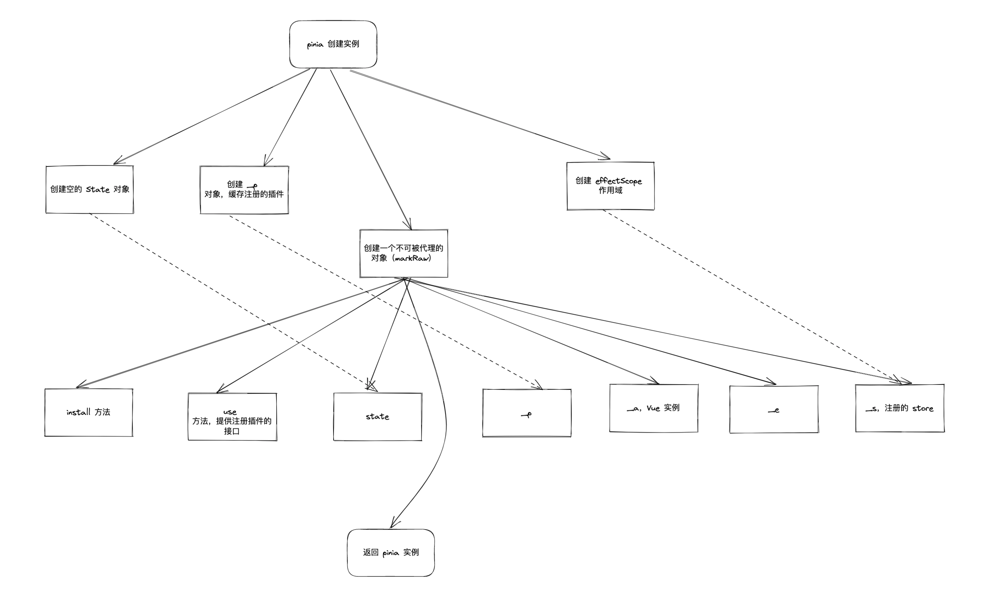
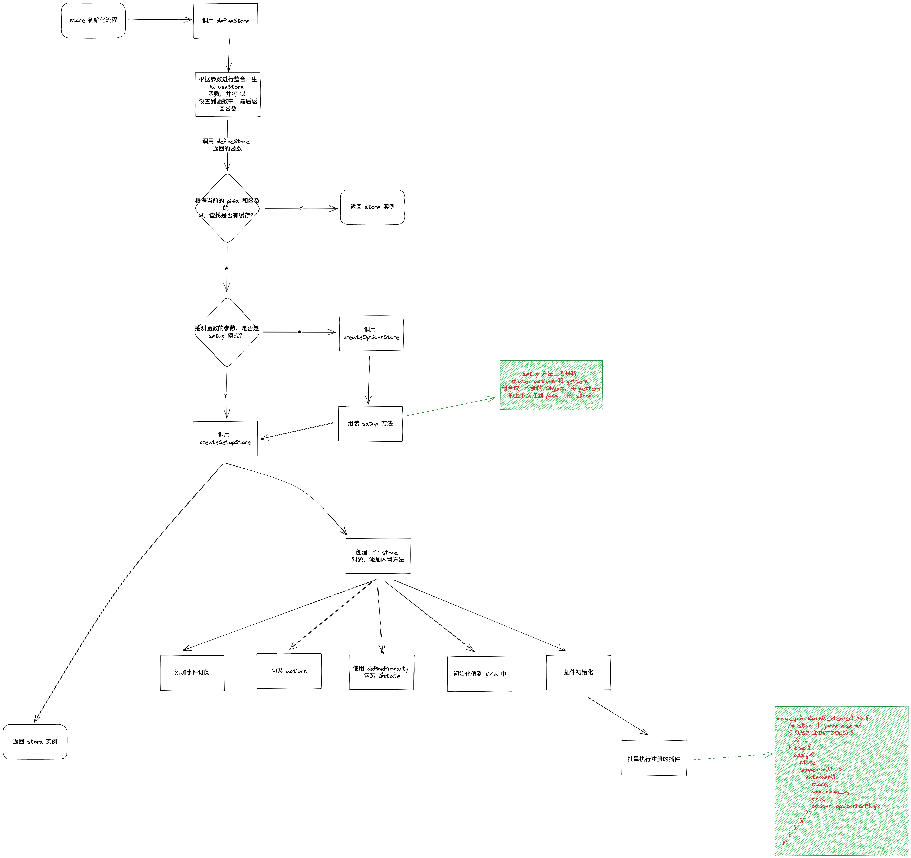

## 学习的目标

1. Pinia 的整体架构是怎样
2. 学习原理，如何缓存数据

## Pinia 的整体架构





## 问题

### vue3 中的 markRaw 的作用

将一个响应式对象/对象转为普通对象，并且标记不可被转为代理

1. [vue3 官方文档 - markRaw](https://cn.vuejs.org/api/reactivity-advanced.html#markraw)

### vue3 中的 effectScope 的作用

生成一个临时的作用域空间，在这作用域空间下使用的 ref, watch, watchEffect 等工具，当着作用域要销毁时，里面的响应式都会随之而销毁

简单来说，就是帮你创建一个临时的作用域，让你不需要处理里面的响应式的销毁时刻，响应式会随作用域自动销毁

代码演示：

```typescript
const scope = effectScope();
const state = scope.run(() => {
  const b = ref(2);
  watch(b, () => {
    console.log("update b", b.value);
  });
  return { a: 1, b };
});
state.b.value += 1; // 触发日志 update b

setTimeout(() => {
  scope.stop();
  state.b.value = 0; // 不会触发日志
}, 100);
```

1. [vue3 官方文档 - effectScope](https://cn.vuejs.org/api/reactivity-advanced.html#effectscope)
2. [effectScope - rfc](https://github.com/vuejs/rfcs/blob/master/active-rfcs/0041-reactivity-effect-scope.md)

#### 为什么 Pinia 要使用 effectScope?

统一收集各个 store 的响应式，可以在同一个时刻下对各个 store 进行销毁处理

### Pinia 是如何实现不需要额外定义 TypeScript 类型

#### vuex 的 TypeScript 定义

vuex@4 还是需要额外的定义 state 的类型：

```typescript
// store.ts
import { InjectionKey } from 'vue'
import { createStore, Store } from 'vuex'

// define your typings for the store state
export interface State {
  count: number
}

// define injection key
export const key: InjectionKey<Store<State>> = Symbol()

export const store = createStore<State>({
  state: {
    count: 0
  }
})
```

```typescript
// main.ts
import { createApp } from 'vue'
import { store, key } from './store'

const app = createApp({ ... })

// pass the injection key
app.use(store, key)

app.mount('#app')
```

```typescript
// in a vue component
import { useStore } from 'vuex'
import { key } from './store'

export default {
  setup () {
    const store = useStore(key)

    store.state.count // typed as number
  }
}
```

#### Pinia 的处理方式

Pinia 通过泛型的形式，根据用户传入的值自动生成对应的类型描述：

```typescript
// 伪代码
export function defineStore<
  Id extends string,
  S extends StateTree = {},
  G extends _GettersTree<S> = {},
  // cannot extends ActionsTree because we loose the typings
  A /* extends ActionsTree */ = {}
>(
  id: Id,
  options: Omit<DefineStoreOptions<Id, S, G, A>, 'id'>
): StoreDefinition<Id, S, G, A>
```

定义了 ID, S(state), G(getters), A(actions) 等四个泛型，分别对应使用 `defineStore` 传入的各个值，这样就能自动生成 TypeScript 的描述。

#### Pinia 的 TypeScript 定义那么简单，为什么 Vuex@4 不能实现？

TODO...

### 插件机制的实现原理

注册插件：

在 `createPinia.ts` 的 `createPinia` 中：

```typescript
// 伪代码
use(plugin) {
  _p.push(plugin)
  return this
}
```

只是简单的将用户传入的插件函数，存在 `_p` 中

在 `store.ts` 中的 createSetupStore 函数，有这样一段代码：

```typescript
// 伪代码
// apply all plugins
pinia._p.forEach((extender) => {
  /* istanbul ignore else */
  if (USE_DEVTOOLS) {
    // ...
  } else {
    Object.assign(
      store,
      scope.run(() =>
        extender({
          store,
          app: pinia._a,
          pinia,
          options: optionsForPlugin,
        })
      )!
    )
  }
})
```

它将当前 `defineStore` 生成的 store ，Pinia 的实例，Vue 实例和插件的配置传入给插件（函数）中，插件会执行相关的业务代码，从而形成插件。

> 插件可以做到事：
>
> - Add new properties to stores
> - Add new options when defining stores
> - Add new methods to stores
> - Wrap existing methods
> - Change or even cancel actions
> - Implement side effects like [Local Storage](https://developer.mozilla.org/en-US/docs/Web/API/Window/localStorage)
> - Apply **only** to specific stores

常见能做的事情：

1. 批量插入属性
2. 数据持久化
   1. 插件可以监听任何数据的变化
3. action 的封装，比如在执行任何 action 前，可以进行一些拦截操作

1. [pinia 官方文档 - 插件](https://pinia.vuejs.org/core-concepts/plugins.html)

## 实现一个简单的 store

```javascript
const useStore = defineStore({
  state: () => ({ d: 1 }),
  getters() {
    return {
      a: (state) => {},
      b() => this.xxx
    }
  },
  actions: {
    getA() {
      return this.a
    },
    setD(val) {
      this.d = val
    }
  }
})

// use
const user1 = useStore()
const user2 = useStore()
user1.d === user2.d
user1.d = 2
user1.d === user2.d
user2.setD(3)
user1.d === user2.d
user1.d // 3
user2.d // 3
```

实现代码：

```typescript
import { reactive, UnwrapNestedRefs, watchSyncEffect } from "vue";

type DefaultState = Record<string, any>;
type DefaultAction = Record<string, (this: any, ...args: unknown[]) => unknown>;
type StoreGetters<T extends DefaultState> = Record<
  string,
  (state?: T) => unknown
>;

type StoreIns<
  S extends DefaultState = {},
  G extends StoreGetters<S> = {},
  A extends DefaultAction = {}
> = UnwrapNestedRefs<S> & G & A;

interface MockPinia<
  S extends DefaultState,
  G extends StoreGetters<S>,
  A extends DefaultAction
> {
  stores: Record<string, StoreIns<S, G, A>>;
  get: (id: string) => StoreIns<S, G, A> | undefined;
  set: (id: string, store: StoreIns<S, G, A>) => StoreIns<S, G, A>;
}

const stores: Record<string, StoreIns> = {};

const mockPinia: MockPinia<
  DefaultState,
  StoreGetters<DefaultState>,
  DefaultAction
> = {
  stores,
  get: (id) => stores[id],
  set: (id, store) => (stores[id] = store),
};

// 将用户传入的配置，形成响应式的
function handleData<
  S extends DefaultState,
  G extends StoreGetters<S>,
  A extends DefaultAction
>(
  store: StoreIns<S, G, A>,
  options: {
    state: () => S;
    getters: G;
    actions: A;
  }
) {
  // 处理 state
  const initState = options.state();
  Object.entries(initState).forEach(([k, v]) => {
    // @ts-ignore
    store[k] = v;
  });
  // 处理 actions
  Object.entries(options.actions).forEach(([k, v]) => {
    // @ts-ignore
    store[k] = v.bind(store);
  });
  // 处理 getters
  Object.entries(options.getters).forEach(([k, v]) => {
    watchSyncEffect(() => {
      // @ts-ignore
      store[k] = v.call(store, store);
    });
  });
}

export const defineStore = <
  $id extends string,
  S extends DefaultState,
  G extends StoreGetters<S>,
  A extends DefaultAction
>(
  id: $id,
  options: {
    state: () => S;
    getters: G;
    actions: A;
  }
) => {
  const store: StoreIns<S, G, A> = reactive({}) as StoreIns<S, G, A>;
  handleData(store, options);

  function use() {
    return store;
  }

  use.$id = id;
  mockPinia.set(id, store);

  return use;
};

```

