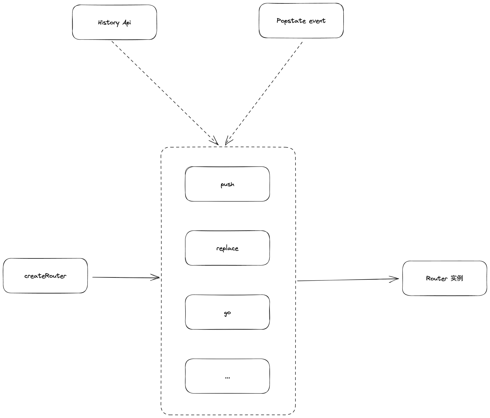
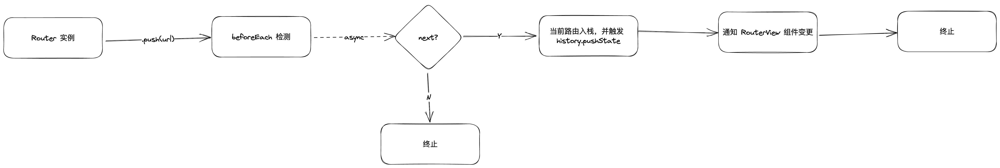

# Vue-Router 源码阅读


## 目标

1. 浏览器路由实现的原理
2. 如何实现 `<route-view />` 组件
3. 代码结构
4. 实现一个简单的 DEMO
   1. 实现 History 和 Hash 两种模式
      1. push, back, replace, go, forward, back
   2. 支持 path 和 name 的路由跳转，支持传参
   3. 根据路由信息，渲染对应的组件，输出 `<mock-router-view />`
   4. 支持守卫模式


## 代码结构


### 代码目录

主要看下根目录结构和 src 目录：

```shell
[ 672]  .
|-- [ 57K]  CHANGELOG.md
|-- [ 680]  SECURITY.md
|-- [ 864]  __tests__
|-- [ 915]  api-extractor.json
|-- [ 608]  e2e
|-- [ 179]  index.js
|-- [ 684]  jest.config.js
|-- [6.5K]  nightwatch.conf.js
|-- [3.9K]  package.json
|-- [6.6K]  rollup.config.mjs
|-- [ 160]  size-checks
|-- [ 736]  src
|   |-- [9.5K]  RouterLink.ts
|   |-- [7.5K]  RouterView.ts
|   |-- [ 217]  config.ts
|   |-- [ 15K]  devtools.ts
|   |-- [4.9K]  encoding.ts
|   |-- [5.5K]  errors.ts
|   |-- [ 233]  global.d.ts
|   |-- [2.7K]  globalExtensions.ts
|   |-- [ 192]  history
|   |   |-- [4.8K]  common.ts
|   |   |-- [2.1K]  hash.ts
|   |   |-- [9.8K]  html5.ts
|   |   `-- [3.2K]  memory.ts
|   |-- [2.3K]  index.ts
|   |-- [1.5K]  injectionSymbols.ts
|   |-- [6.9K]  location.ts
|   |-- [ 224]  matcher
|   |   |-- [ 17K]  index.ts
|   |   |-- [1.5K]  pathMatcher.ts
|   |   |-- [ 11K]  pathParserRanker.ts
|   |   |-- [4.9K]  pathTokenizer.ts
|   |   `-- [2.4K]  types.ts
|   |-- [ 13K]  navigationGuards.ts
|   |-- [4.1K]  query.ts
|   |-- [ 41K]  router.ts
|   |-- [6.3K]  scrollBehavior.ts
|   |-- [ 160]  types
|   |   |-- [ 13K]  index.ts
|   |   |-- [ 342]  typeGuards.ts
|   |   `-- [ 762]  utils.ts
|   |-- [ 539]  useApi.ts
|   |-- [ 192]  utils
|   |   |-- [  60]  README.md
|   |   |-- [ 461]  callbacks.ts
|   |   |-- [  55]  env.ts
|   |   `-- [ 913]  index.ts
|   `-- [ 314]  warning.ts
|-- [ 320]  test-dts
|-- [ 672]  tests_output
|-- [ 725]  tsconfig.json
`-- [ 128]  vetur

32 directories, 170 files
```


### 路由处理流程

> Vue-Router 整个路由触发的流程：
> 
> 1.  Navigation triggered.
> 2.  Call `beforeRouteLeave` guards in deactivated components.
> 3.  Call global `beforeEach` guards.
> 4.  Call `beforeRouteUpdate` guards in reused components.
> 5.  Call `beforeEnter` in route configs.
> 6.  Resolve async route components.
> 7.  Call `beforeRouteEnter` in activated components.
> 8.  Call global `beforeResolve` guards.
> 9.  Navigation is confirmed.
> 10.  Call global `afterEach` hooks.
> 11.  DOM updates triggered.
> 12.  Call callbacks passed to `next` in `beforeRouteEnter` guards with instantiated instances.
> 
> 来源：Vue-Router 官方文档

## 问题

### 如何实现支持 hash、history 和 memory 模式？

三种模式分别使用：
1. createWebHashHistory
2. createWebHistory
3. createMemoryHistory
来生成 `history` 实例，并传给 `createRouter` 的 `history` 属性
三种的实现，都是基于 `RouterHistory` 的定义来实现，这样在使用 `history` 的时候不要过多地考虑什么模式要特别地处理，只关注使用即可。具体地处理分别在三个函数里面


### <router-view /> 的实现
基于 `defineComponent` 的函数组件：
1. 提供一些依赖
2. 从 `matchedRoute` 获取到要渲染的路由组件
3. 当路由信息变化时，根据相关逻辑触发 `leaveGuards` 和 `updateGuards`

### 为什么 `useRoute` 和 `useRouter` 不能在 `setup` 和函数组件外使用

因为 `route` 和 `router` 需要拿到当前 Vue 的上下文。而 `useRoute` 等方法是基于 Vue 的 compositionAPI 的，如果不在 `setup` 和函数组件内使用，无法拿到当前 Vue 实例的上下文

### 什么情况会触发 `popState` 事件

1.  用户点击浏览器的前进或后退按钮。
2.  使用 JavaScript 中的 `history.back()`、`history.forward()` 或 `history.go()` 方法导航历史记录。
3.  使用 JavaScript 中的 `history.pushState()` 或 `history.replaceState()` 方法改变历史记录，但请注意，这两个方法本身不会触发 `popstate` 事件。只有当用户在由这些方法创建的历史记录条目之间导航时，才会触发 `popstate` 事件。

## 其他

利用 `pushState` 和 `replaceState` 不会触发 `popState` 事件的特点，在 `push` 的前，先将当前
路由 state 的 `forward` 设为要去的路由，并使用 `history.replaceState` 替换，然后才使用 `pushState` 进行跳转。

然后当用户后退，再前进的时候，就能获取到要前进的 `state` 是什么

## DEMO
结构：



路由执行的流程：


### 第一版
简单实现了以下功能：
1. 基于 history 模式，实现 push, replace, go, back, beforeEach 等方法和钩子
2. 实现 `router-view` 组件，基于配置和当前 URL 信息，选项渲染对应的组件

存在的问题：
1. 当前的 beforeEach 的实现，是根据缓存的路由栈去获取 from 信息，再判断是否通过，这样可以在 URL 变化前做操作。但首次进入页面后，触发 go 和 back 方法时，beforeEach 的钩子参数会获取不了


`mock-router`:

``` typescript
import { h, reactive, ref } from "vue"
import { observer } from "../utils"

type TQuery = Record<string, string>

export interface IRouteItem {
  path: string
  query: TQuery
  component: any
  children: IRouteItem[]
}

export interface MRouterOptions {
  mode: 'hash' | 'history'
  routes: IRouteItem[]
}
type TBeforeEach = (to: IStackItem, from: IStackItem, next: (val: boolean) => void) => void
export interface IRouter {
  push: (path: string, query?: TQuery) => void
  replace: (path: string, query?: TQuery) => void
  go: (number: number) => void
  back: () => void
  beforeEach?: TBeforeEach
  afterEach?: (to: IStackItem, from: IStackItem) => void
  setBeforeEach: (b: TBeforeEach) => void
}

export interface IStackItem {
  path: string
  query?: TQuery
}

class Stack {
  data: IStackItem[] = []
  cb = (data: IStackItem) => {}

  constructor(pCb: (data: IStackItem) => void) {
    this.cb = pCb
  }

  add(data: IStackItem) {
    this.data.unshift(data)
    this.cb(data)
  }

  replace(data: IStackItem) {
    this.data.shift()
    this.add(data)
    this.cb(data)
  }

  shift() {
    if (!this.data.length) return
    const data = this.data.shift()
    if (data) this.cb(data)
    return data
  }

  getCurrent() {
    return this.data[0]
  }

  getPrev() {
    return this.data[1]
  }
}

const getPathWithQuery = (path: string, query?: TQuery) => {
  // const url = new URL(path);
  let url = ''
  if (path.includes('?')) {
    url = path + '?'
  } else {
    url = path
  }
  return url + Object.values(query ?? {}).map(([k, v]) => {
    return `${k}=${v}`
  }).join('&')
}

export const createRouter = (options: MRouterOptions): IRouter => {

  let beforeEach: IRouter['beforeEach'] = (to, from, next) => next(true)
  let afterEach: IRouter['afterEach'] = (to, from) => {}

  const currentState = ref<IStackItem>({
    path: '',
    query: {}
  })

  function getCurrentState() {
    if (history.state) return history.state
    const { pathname } = location
    return options.routes.find(v => v.path === pathname)
  }

  function getComponentByPath(path: string) {
    const route = options.routes.find(v => v.path === path)
    return route
  }

  const stack = new Stack((data) => {
    currentState.value.query = data.query
    currentState.value.path = data.path
    const route = getComponentByPath(data.path)
    if (route) {
      observer.dispatch('change', route.component)
    }
  })
  const checkBeforeEach = (to: IStackItem, from: IStackItem) => {
    return new Promise(resolve => {
      if (beforeEach) {
        beforeEach(to, from, (next: boolean) => {
          resolve(next)
        })
      }
    })
  }
  let isGo = true
  const push = async (path: string, query?: TQuery) => {
    const to = {
      path, query
    }
    const next = await checkBeforeEach(to, stack.getCurrent())
    console.log('next', next);
    if (!next) return
    history.pushState(to, '', getPathWithQuery(path, query))
    stack.add({ path, query })
  }
  const replace = async (path: string, query?: TQuery) => {
    const to = {
      path, query
    }
    const next = await checkBeforeEach(to, stack.getCurrent())
    if (!next) return
    history.replaceState(to, '', getPathWithQuery(path, query))
    stack.replace({ path, query })
  }
  const go = (number: number) => {
    // TODO
    isGo = true
    history.go(number)
  }
  const back = async () => {
    const next = await checkBeforeEach(stack.getPrev(), stack.getCurrent())
    if (!next) return
    isGo = false
    history.back()
  }


  window.addEventListener("popstate", (event) => {
    console.log(
      `location: ${document.location}, state: `,
      event.state
    );
    if (isGo) {
      stack.add(event.state)
    } else {
      stack.shift()
    }
  });

  setTimeout(() => {
    stack.add(getCurrentState())
  }, 0);

  const router = {
    push,
    replace,
    go,
    back,
    beforeEach,
    afterEach,
    setBeforeEach: (b: IRouter['beforeEach']) => {
      beforeEach = b
    }
  }
  return router
}

```

`mock-router-view`
``` vue
<template>
  <component v-if="state.component" :is="state.component" />
</template>

<script lang="ts">
export default { name: 'RouterView' }
</script>
<script lang="ts" setup>
import { reactive } from 'vue'
import { observer } from "../utils"
const state = reactive<{ component: any }>({
    component: undefined
  })
  console.log('init');
  const sub = observer.createSubscriber()
  sub.addListener('change', (com: any) => {
    console.log('change component', com);
    state.component = com
  })
</script>
```


### chatGPT 生成的 Hash 模式的路由

``` typescript
class HashRouter {
  constructor() {
    // 初始化时，监听 hashchange 事件
    window.addEventListener('hashchange', this.onHashChange);
  }

  // 更新 hash
  public navigate(hash: string): void {
    window.location.hash = hash;
  }

  // 处理 hash 变化
  private onHashChange = (): void => {
    const currentHash = window.location.hash;
    console.log('Hash changed:', currentHash);
    // 在这里执行你的导航逻辑，例如更新页面内容或改变页面状态
  };
}

// 使用 HashRouter
const router = new HashRouter();

// 导航到一个新的 hash
router.navigate('#/example');

```

## 参考资料
1. [History api - mdn](https://developer.mozilla.org/en-US/docs/Web/API/History)
2. [Popstate event - mdn](https://developer.mozilla.org/en-US/docs/Web/API/Window/popstate_event)
3. 