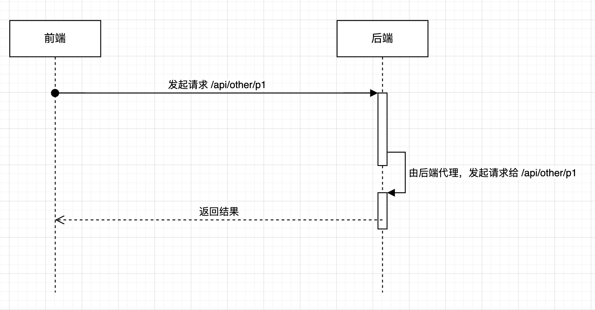

## 前言

>跨域头配置，现在要针对某一域名，可进行跨域访问。本文只是方便自己进行查阅，会有大量的复制粘贴文本，来源都写在“参考”里

## 什么是跨域？

产生跨域现象有两个对象，访问者和被访问者，当着两者各自 URL 的协议、域名或端口有一处不是一样的情况下，就会出现跨域现象，跨域会导致这次请求无法正常响应

跨域是基于浏览器的同源策略所出现的异常。

而为什么要有这个同源策略，在下面的“安全”会说明。

同源策略的目的是帮忙阻断恶意文档，减少可能被攻击的媒介

## 解决跨域的办法

### 资源请求的跨域解决方法

#### 添加 CORS 头

服务端在接口响应时，添加 `Access-Control-Allow-Origin: *` 头部，即可解决跨域问题，`*` 可以改成不同的域名。


#### Nginx 代理

可以通过 nginx 的 `location` 配置，代理不同路径的请求：

```shell
location /ddd {
    proxy_pass http://localhost:8080;
}

location /test {
    proxy_pass http://localhost:8081;
}
```

nginx 代理是最常用的方式。


#### 后端添加代理



简单来说，前端发起的请求，由后端来发起请求，因为服务之间的请求是没有跨域问题，所以可以正常拿到结果，然后返回给前端。


#### jsonp

利用 `script` 标签不受跨域的影响，加载一个链接，该链接资源返回的内容，是返回一个 JS 的函数，并且函数会返回相关的数据。等资源加载完后，前端执行对应的函数，拿到数据。


更多的跨域处理方法，可以看这篇文章 [前端场景跨域解决方法](https://segmentfault.com/a/1190000011145364)


### 除了请求，还有什么操作会被限制？

1. `iframe.contentWindow`
2. `window.parent`
3. `window.open`
4. `window.opener`
4. `cookie`


## 跨域资源共享(CORS - Corss-Origin Resource Sharing)

### CORS 是什么

CORS 是一种 HTTP 协议的机制，通过在响应头部添加相关字段，告诉浏览器是否可以加载资源。因为浏览器使用同源策略，所以提供了 CORS 机制，帮助使用者解决跨域问题。

所有的跨域请求，会被分成两类：

1. 简单请求：
   1. 使用 GET、POST 和 HEAD 请求
   2. Headers 中只有以下几个字段：
      1. Accept
      2. Accept_Language
      3. Content-Language
      4. Content-Type
         1. text/plain
         2. multipart/form-data
         3. application/x-www-form-urlencoded
   3. xhr 对象均没有注册任何事件监听器（我测试过，就算添加了事件：`xhr.onload` 还是发送简单请求，不知道如何触发）
   4. 使用 ReadableStream 对象
2. 预检请求：
   1. 不符合简单请求的情况下，就会发送预检请求

> 为什么要有预检请求？
>
> ​		MDN: 可以避免跨域请求对服务器的用户数据产生未预期的影响。

简单来说，预检请求，会在发送你的请求前，先发送一个同样地址、`method` 为 `OPTIONS` 的请求，校验该跨域接口是否符合要求。


### 使用

### 简单请求处理

简单请求，只需在响应请求头加添加 `Access-Control-Allow-Origin` 字段：

```javascript
// * 可以改成不同的域名，比如 http://localhost:3000,http://localhost:3001
res.setHeader('Access-Control-Allow-Origin', '*')
```


### 预检请求处理

预检请求，会先发送一个 `OPTIONS` 请求，这里要注意，`OPTIONS`  的请求和对应资源的请求，两者都要加上 CORS 头部。

比如 `http://localhost:3000` 请求 GET  `http://localhost:8000/api/test` 接口，这时候服务端的配置是：

```javascript
route('/api/test').options((res) => {
  res.setHeader('Access-Control-Allow-Origin', '*')
})
route('/api/test').get((res) => {
  res.setHeader('Access-Control-Allow-Origin', '*')
})
```

如果是服务端配置，就要在同一个接口地址不同的协议，加上 CORS 头部。

因为触发预检请求，通常是用了别的协议或使用另外的 Headers，所以通常也需要加上以下几个请求头：

```javascript
route('/api/test').options((res) => {
  res.setHeader('Access-Control-Allow-Origin', '*')
  res.setHeader('Access-Control-Allow-Methods', '*')
  res.setHeader('Access-Control-Allow-Headers', '*')
})
route('/api/test').get((res) => {
  res.setHeader('Access-Control-Allow-Origin', '*')
})
```

具体协议头的作用，下面会进行列举。


### 响应首部字段

[详细看 MDN 文档](https://developer.mozilla.org/zh-CN/docs/Web/HTTP/CORS#http_%E5%93%8D%E5%BA%94%E9%A6%96%E9%83%A8%E5%AD%97%E6%AE%B5)

## Cookie

### 是什么

Cookie 是浏览器的一种存储机制，它可以存储 4 KB 左右的数据在浏览器中，每次发起 HTTP 请求时，会根据 Cookie 的配置随着请求头发送到服务端；而服务端也可以通过配置 `Set-Cookie` 来修改对应浏览器的 Cookie。

主要用于缓存一些会话状态或个性化的配置。

### 属性解析

具体的解析，才查看 [mdn cookie 文档](https://developer.mozilla.org/zh-CN/docs/Web/HTTP/Cookies#%E9%99%90%E5%88%B6%E8%AE%BF%E9%97%AE_cookie)，这里快速说下我想记录的。

#### Secure

设置了 `Secure` 的话，cookie 只应在 Https 的协议下传输。

>MDN：从 Chrome 52 和 Firefox 52 开始，不安全的站点（`http:`）无法使用Cookie的 `Secure` 标记。

也就是说，现在的 Chrome 等现代浏览器，只有 Cookie 设置了 Secure ，在不安全站点就不会被携带发送。


#### HttpOnly

设置了该属性的 Cookie，不能被 `document.cookie` 拿到。


#### Domain

指定哪些域名可以接受该 Cookie: `Set-Cookie: ddd=a; Domain=ddd.com`。只能配置一个。


#### Path

和 Domain 一样的功能，只不过限制是根据路径而已。

这里要注意下，我在写这篇记录的时候，使用的是 Chrome@v94 版本（2022-01-17），如果 Path 不命中或者没有设置，Chrome 是不会显示的，而且 `document.cookie` 是拿不到值的。而在 Firfox 浏览器，可以在 devtools 看到，但 JS 也拿不到值。


#### SameSite

有三个值：

1. None: 可以同站、跨站请求
2. Strict: 只能同站请求
3. Lax: 与 Strict 类似，但一些图片加载或 iframe 调用，可以允许。现在浏览器的默认配置是 Lax。

**这里如果想通过跨域请求设置 cookie，要使用 SameSite: None + Secure 的组合才可以。**


### 跨域问题

Cookie 是经常使用的存储功能，这里列举我遇到的有关 cookie 的跨域问题。


#### 本地文件如何设置 cookie ?

不能设置，无论是接口的 `Set-cookie` 还是 `document.cookie`，浏览器都限制本地文件不能设置 cookie。

而且在浏览器发送接口返回的 `response`，是拿不到 `Set-cookie` 头部内容的，浏览器是禁止的。

这个问题我是在开发 Electron 应用遇到的，但因为用的是 Electron，所以这问题也能解决，不过麻烦点：

使用 Electron 主进程的 `net.request` 模块进行请求，这时候就不会有浏览器限制，发送接口时，也可以注入 `cookie` 头部。至于为什么不能弃用 `cookie`，因为开发的时候有用到别的旧服务，改不了，所以只能这样解决。


#### http 协议下，如何设置跨域 cookie ?

无解。

要跨域设置 Cookie，并且配置 `SameSite=None;`，而浏览器限制使用 `SameSite` 时要配合 `Secure` 使用；但是配置了 `Secure` 后只能在安全域名下才能传输 `cookei`，所以 `http` 协议无解。

解决方法，切换 https，并且 `Set-cookie` 添加：`SameSite=None; Secure` 这两个配置。


## 前端相关安全问题

### 没有同源策略，会造成什么问题？


## 参考资源

1. [mdn 浏览器的同源策略](https://developer.mozilla.org/zh-CN/docs/Web/Security/Same-origin_policy)

2. [mdn 跨源资源共享（CORS）](https://developer.mozilla.org/zh-CN/docs/Web/HTTP/Access_control_CORS)

3. [前端场景跨域解决方法](https://segmentfault.com/a/1190000011145364)

4. [mdn 预检请求](https://developer.mozilla.org/zh-CN/docs/Glossary/Preflight_request)

5. [mdn Cookie](https://developer.mozilla.org/zh-CN/docs/Web/HTTP/Cookies)

   

