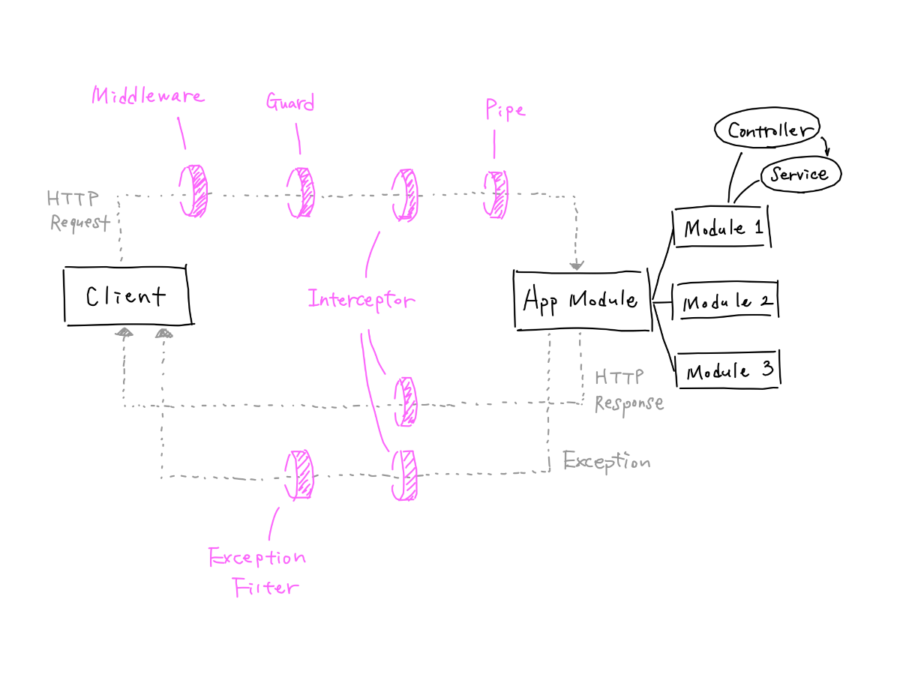

> 在日常开发中，有时候会对这几个模块在什么时候使用产生困惑，比如用什么进行日志打印、用什么进行权限判断、用什么进行响应结果的统一处理


## 生命周期
这是一个请求的生命流程，大概的执行顺序：

> 图来源：https://zenn.dev/morinokami/articles/nestjs-overview

下面是官方文档提供的：
> 1. Incoming request
> Globally bound middleware
> Module bound middleware
> Global guards
> Controller guards
> Route guards
> Global interceptors (pre-controller)
> Controller interceptors (pre-controller)
> Route interceptors (pre-controller)
> Global pipes
> Controller pipes
> Route pipes
> Route parameter pipes
> Controller (method handler)
> Service (if exists)
> Route interceptor (post-request)
> Controller interceptor (post-request)
> Global interceptor (post-request)
> Exception filters (route, then controller, then global)
> end. Server response

## 区别
| 模块        | 功能说明                                               | 常用点 |
| ----------- | ------------------------------------------------------ | ------ |
| middleware  | 可以获取请求和响应的结果，并通过 next 函数控制是否继续 | 打印请求日志   |
| guard       | 请求时，通过返回 true/false 来判断是否继续后面的流程     |    权限控制    |
| pipe        | 请求时，用于数据的处理和数据校验  | 接口的请求参数校验 |
| interceptor | 可以对请求和响应进行数据处理 | 数据结构统一处理 |
| filter      | 响应时，异常处理 | 异常处理 |

### middleware
``` typescript
import { Injectable, NestMiddleware } from '@nestjs/common';

@Injectable()
export class TestMiddlewareMiddleware implements NestMiddleware {
  use(req: any, res: any, next: (err?: Error) => void) {
    console.log('middleware before');
    next();
    console.log('middleware after');
  }
}

```

类似 `express` 的中间件，是一种油葱模型，通过 `next` 调用来执行到下一步，并且 `next` 可以传入 `Error` 中止后续的流程

### guard

``` typescript
import { CanActivate, ExecutionContext, Injectable } from '@nestjs/common';
import { Observable } from 'rxjs';

@Injectable()
export class TestGuardGuard implements CanActivate {
  canActivate(
    context: ExecutionContext,
  ): boolean | Promise<boolean> | Observable<boolean> {
    console.log('guard');
    return true;
  }
}

```

通过返回 true/false 来判断是否继续后面的流程，可以通过 `context` 来获取当前的上下文，并且可以精确到对应某个 `controller` 的方法

### pipe

``` typescript
import { ArgumentMetadata, Injectable, PipeTransform } from '@nestjs/common';

@Injectable()
export class TestPipePipe implements PipeTransform {
  transform(value: any, metadata: ArgumentMetadata) {
    return value;
  }
}

```

可以对函数的参数进行处理，比如 `params`, `queyr`, `body` 等，并且进行数据校验。常见的用法是 `nestjs` 官方提供的 `ValidationPipe` 

### interceptor

``` typescript
import {
  CallHandler,
  ExecutionContext,
  Injectable,
  NestInterceptor,
} from '@nestjs/common';
import { Observable, map } from 'rxjs';

@Injectable()
export class TestInterceptorInterceptor implements NestInterceptor {
  intercept(context: ExecutionContext, next: CallHandler): Observable<any> {
    console.log('interceptor before');
    return next.handle().pipe(
      map((data) => {
        console.log('interceptor after', data);
        return data;
      }),
    );
  }
}

```

拦截器，可以对请求和响应进行数据处理

### filter 
``` typescript
import { ArgumentsHost, Catch, ExceptionFilter } from '@nestjs/common';

@Catch()
export class TestFilterFilter<T> implements ExceptionFilter {
  catch(exception: T, host: ArgumentsHost) {
    console.log('exception');
  }
}

```
异常处理

## 总结
这些都在官方文档有说明，而这里的记录只是针对我个人的总结


## 参考资料
1. [说明和总结 NestJS 的基本概念](https://zenn.dev/morinokami/articles/nestjs-overview)
2. [nestjs 官方文档 - 请求的生命周期](https://docs.nestjs.com/faq/request-lifecycle)
3. 